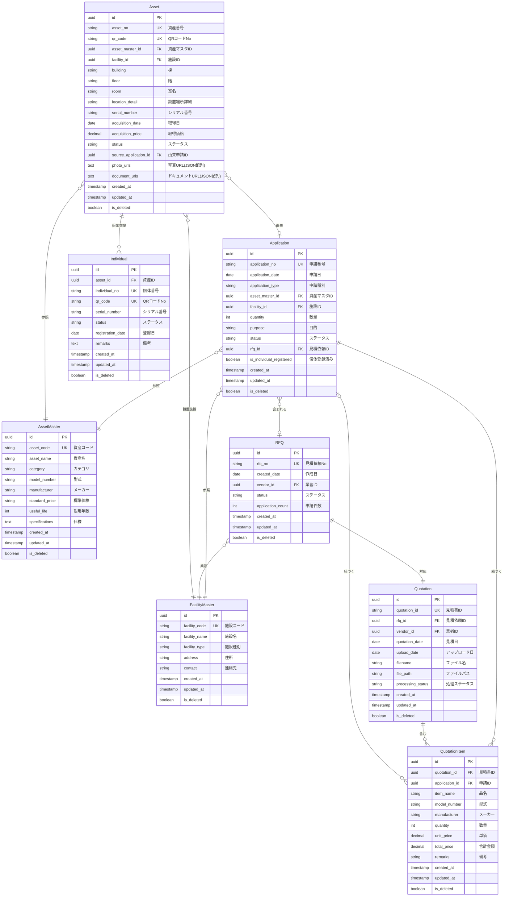

# データベース設計書

## 1. 概要

### 1.1 システム概要
医療機器管理システムのデータベース設計書

### 1.2 技術スタック
- **バックエンド**: FastAPI (Python)
- **フロントエンド**: React (TypeScript)
- **データベース**: PostgreSQL (推奨) / MySQL
- **ORM**: SQLAlchemy

### 1.3 設計方針
- 正規化を基本とし、パフォーマンスが必要な箇所のみ非正規化を検討
- UUIDまたは自動採番によるプライマリキー
- 論理削除による履歴保持
- タイムスタンプによる変更履歴管理

---

## 2. ER図



---

## 3. テーブル定義

### 3.1 Application (申請)

購入・更新・廃棄などの申請情報を管理

| カラム名 | データ型 | NULL | デフォルト | 説明 |
|---------|---------|------|-----------|------|
| id | UUID | NOT NULL | uuid_generate_v4() | プライマリキー |
| application_no | VARCHAR(50) | NOT NULL | - | 申請番号（例: APP-2025-0001） |
| application_date | DATE | NOT NULL | CURRENT_DATE | 申請日 |
| application_type | VARCHAR(20) | NOT NULL | - | 申請種別（新規購入/増設/更新/移動/廃棄/保留） |
| asset_master_id | UUID | NOT NULL | - | 資産マスタID（外部キー） |
| facility_id | UUID | NOT NULL | - | 施設ID（外部キー） |
| quantity | INTEGER | NOT NULL | 1 | 数量 |
| purpose | TEXT | NULL | - | 目的・理由 |
| status | VARCHAR(20) | NOT NULL | '下書き' | ステータス（下書き/承認待ち/承認済み/差戻し/却下） |
| approval_current | INTEGER | NOT NULL | 0 | 現在の承認段階 |
| approval_total | INTEGER | NOT NULL | 0 | 承認必要段階数 |
| rfq_id | UUID | NULL | - | 見積依頼ID（外部キー） |
| vendor_id | UUID | NULL | - | 購入先業者ID（外部キー） |
| quotation_asset_name | VARCHAR(200) | NULL | - | 見積資産名 |
| quotation_price | DECIMAL(12,2) | NULL | - | 見積金額 |
| quotation_item_count | INTEGER | NULL | - | 見積明細件数 |
| is_individual_registered | BOOLEAN | NOT NULL | FALSE | 個体登録済みフラグ |
| created_at | TIMESTAMP | NOT NULL | CURRENT_TIMESTAMP | 作成日時 |
| updated_at | TIMESTAMP | NOT NULL | CURRENT_TIMESTAMP | 更新日時 |
| is_deleted | BOOLEAN | NOT NULL | FALSE | 論理削除フラグ |

**制約**:
- PRIMARY KEY: `id`
- UNIQUE KEY: `application_no`
- FOREIGN KEY: `asset_master_id` REFERENCES `asset_master(id)`
- FOREIGN KEY: `facility_id` REFERENCES `facility_master(id)`
- FOREIGN KEY: `rfq_id` REFERENCES `rfq(id)`
- FOREIGN KEY: `vendor_id` REFERENCES `facility_master(id)`
- CHECK: `application_type IN ('新規購入', '増設', '更新', '移動', '廃棄', '保留')`
- CHECK: `status IN ('下書き', '承認待ち', '承認済み', '差戻し', '却下')`
- CHECK: `quantity > 0`

**インデックス**:
- `idx_application_no` ON `application_no`
- `idx_application_status` ON `status`
- `idx_application_rfq_id` ON `rfq_id`
- `idx_application_created_at` ON `created_at`

---

### 3.2 RFQ (見積依頼)

業者への見積依頼情報を管理

| カラム名 | データ型 | NULL | デフォルト | 説明 |
|---------|---------|------|-----------|------|
| id | UUID | NOT NULL | uuid_generate_v4() | プライマリキー |
| rfq_no | VARCHAR(50) | NOT NULL | - | 見積依頼No（例: RFQ-2025-0001） |
| created_date | DATE | NOT NULL | CURRENT_DATE | 作成日 |
| vendor_id | UUID | NOT NULL | - | 業者ID（外部キー） |
| status | VARCHAR(20) | NOT NULL | '依頼書作成待' | ステータス |
| application_count | INTEGER | NOT NULL | 0 | 申請件数 |
| application_ids | TEXT | NULL | - | 申請IDリスト（JSON配列） |
| created_at | TIMESTAMP | NOT NULL | CURRENT_TIMESTAMP | 作成日時 |
| updated_at | TIMESTAMP | NOT NULL | CURRENT_TIMESTAMP | 更新日時 |
| is_deleted | BOOLEAN | NOT NULL | FALSE | 論理削除フラグ |

**制約**:
- PRIMARY KEY: `id`
- UNIQUE KEY: `rfq_no`
- FOREIGN KEY: `vendor_id` REFERENCES `facility_master(id)`
- CHECK: `status IN ('依頼書作成待', '見積依頼済', '見積待ち', '見積受領')`
- CHECK: `application_count >= 0`

**インデックス**:
- `idx_rfq_no` ON `rfq_no`
- `idx_rfq_vendor_id` ON `vendor_id`
- `idx_rfq_status` ON `status`
- `idx_rfq_created_date` ON `created_date`

---

### 3.3 Quotation (見積書)

業者から受領した見積書を管理

| カラム名 | データ型 | NULL | デフォルト | 説明 |
|---------|---------|------|-----------|------|
| id | UUID | NOT NULL | uuid_generate_v4() | プライマリキー |
| quotation_id | VARCHAR(50) | NOT NULL | - | 見積書ID（例: Q-1737000000001） |
| rfq_id | UUID | NOT NULL | - | 見積依頼ID（外部キー） |
| vendor_id | UUID | NOT NULL | - | 業者ID（外部キー） |
| quotation_date | DATE | NOT NULL | - | 見積日 |
| upload_date | DATE | NOT NULL | CURRENT_DATE | アップロード日 |
| filename | VARCHAR(255) | NOT NULL | - | ファイル名 |
| file_path | VARCHAR(500) | NOT NULL | - | ファイルパス（S3など） |
| processing_status | VARCHAR(20) | NOT NULL | '未処理' | 処理ステータス |
| ocr_result | TEXT | NULL | - | OCR結果（JSON） |
| created_at | TIMESTAMP | NOT NULL | CURRENT_TIMESTAMP | 作成日時 |
| updated_at | TIMESTAMP | NOT NULL | CURRENT_TIMESTAMP | 更新日時 |
| is_deleted | BOOLEAN | NOT NULL | FALSE | 論理削除フラグ |

**制約**:
- PRIMARY KEY: `id`
- UNIQUE KEY: `quotation_id`
- FOREIGN KEY: `rfq_id` REFERENCES `rfq(id)`
- FOREIGN KEY: `vendor_id` REFERENCES `facility_master(id)`
- CHECK: `processing_status IN ('未処理', 'OCR完了', '紐付け完了')`

**インデックス**:
- `idx_quotation_id` ON `quotation_id`
- `idx_quotation_rfq_id` ON `rfq_id`
- `idx_quotation_vendor_id` ON `vendor_id`
- `idx_quotation_processing_status` ON `processing_status`
- `idx_quotation_upload_date` ON `upload_date`

---

### 3.4 QuotationItem (見積明細)

見積書内の個別品目を管理

| カラム名 | データ型 | NULL | デフォルト | 説明 |
|---------|---------|------|-----------|------|
| id | UUID | NOT NULL | uuid_generate_v4() | プライマリキー |
| quotation_id | UUID | NOT NULL | - | 見積書ID（外部キー） |
| application_id | UUID | NULL | - | 申請ID（外部キー、紐付け後） |
| item_name | VARCHAR(200) | NOT NULL | - | 品名 |
| model_number | VARCHAR(100) | NULL | - | 型式 |
| manufacturer | VARCHAR(100) | NULL | - | メーカー |
| quantity | INTEGER | NOT NULL | 1 | 数量 |
| unit_price | DECIMAL(12,2) | NOT NULL | - | 単価 |
| total_price | DECIMAL(12,2) | NOT NULL | - | 合計金額 |
| remarks | TEXT | NULL | - | 備考 |
| matching_score | DECIMAL(5,2) | NULL | - | マッチングスコア（0-100） |
| created_at | TIMESTAMP | NOT NULL | CURRENT_TIMESTAMP | 作成日時 |
| updated_at | TIMESTAMP | NOT NULL | CURRENT_TIMESTAMP | 更新日時 |
| is_deleted | BOOLEAN | NOT NULL | FALSE | 論理削除フラグ |

**制約**:
- PRIMARY KEY: `id`
- FOREIGN KEY: `quotation_id` REFERENCES `quotation(id)`
- FOREIGN KEY: `application_id` REFERENCES `application(id)`
- CHECK: `quantity > 0`
- CHECK: `unit_price >= 0`
- CHECK: `total_price >= 0`

**インデックス**:
- `idx_quotation_item_quotation_id` ON `quotation_id`
- `idx_quotation_item_application_id` ON `application_id`

---

### 3.5 Asset (資産)

医療機器などの資産情報を管理

| カラム名 | データ型 | NULL | デフォルト | 説明 |
|---------|---------|------|-----------|------|
| id | UUID | NOT NULL | uuid_generate_v4() | プライマリキー |
| asset_no | VARCHAR(50) | NOT NULL | - | 資産番号（例: ASS-2025-0001） |
| qr_code | VARCHAR(50) | NOT NULL | - | QRコードNo |
| asset_master_id | UUID | NOT NULL | - | 資産マスタID（外部キー） |
| facility_id | UUID | NOT NULL | - | 施設ID（外部キー） |
| building | VARCHAR(50) | NULL | - | 棟 |
| floor | VARCHAR(20) | NULL | - | 階 |
| room | VARCHAR(50) | NULL | - | 室名 |
| location_detail | VARCHAR(200) | NULL | - | 設置場所詳細 |
| serial_number | VARCHAR(100) | NULL | - | シリアル番号 |
| acquisition_date | DATE | NOT NULL | - | 取得日 |
| acquisition_price | DECIMAL(12,2) | NULL | - | 取得価格 |
| depreciation_method | VARCHAR(50) | NULL | - | 償却方法 |
| useful_life | INTEGER | NULL | - | 耐用年数 |
| depreciation_rate | DECIMAL(5,2) | NULL | - | 償却率 |
| status | VARCHAR(20) | NOT NULL | '使用中' | ステータス |
| source_application_id | UUID | NULL | - | 由来申請ID（外部キー） |
| disposal_date | DATE | NULL | - | 廃棄日 |
| disposal_reason | TEXT | NULL | - | 廃棄理由 |
| photo_urls | TEXT | NULL | - | 写真URLリスト（JSON配列、最大6件） |
| document_urls | TEXT | NULL | - | ドキュメントURLリスト（JSON配列） |
| remarks | TEXT | NULL | - | 備考 |
| created_at | TIMESTAMP | NOT NULL | CURRENT_TIMESTAMP | 作成日時 |
| updated_at | TIMESTAMP | NOT NULL | CURRENT_TIMESTAMP | 更新日時 |
| is_deleted | BOOLEAN | NOT NULL | FALSE | 論理削除フラグ |

**制約**:
- PRIMARY KEY: `id`
- UNIQUE KEY: `asset_no`
- UNIQUE KEY: `qr_code`
- FOREIGN KEY: `asset_master_id` REFERENCES `asset_master(id)`
- FOREIGN KEY: `facility_id` REFERENCES `facility_master(id)`
- FOREIGN KEY: `source_application_id` REFERENCES `application(id)`
- CHECK: `status IN ('使用中', '保管中', '廃棄済み', '修理中', '移動中')`

**インデックス**:
- `idx_asset_no` ON `asset_no`
- `idx_asset_qr_code` ON `qr_code`
- `idx_asset_master_id` ON `asset_master_id`
- `idx_asset_facility_id` ON `facility_id`
- `idx_asset_status` ON `status`
- `idx_asset_acquisition_date` ON `acquisition_date`

---

### 3.6 AssetMaster (資産マスタ)

資産の種類や標準仕様を管理

| カラム名 | データ型 | NULL | デフォルト | 説明 |
|---------|---------|------|-----------|------|
| id | UUID | NOT NULL | uuid_generate_v4() | プライマリキー |
| asset_code | VARCHAR(50) | NOT NULL | - | 資産コード |
| asset_name | VARCHAR(200) | NOT NULL | - | 資産名 |
| category | VARCHAR(50) | NOT NULL | - | カテゴリ |
| model_number | VARCHAR(100) | NULL | - | 型式 |
| manufacturer | VARCHAR(100) | NULL | - | メーカー |
| standard_price | DECIMAL(12,2) | NULL | - | 標準価格 |
| useful_life | INTEGER | NULL | - | 標準耐用年数 |
| specifications | TEXT | NULL | - | 仕様詳細（JSON） |
| is_medical_device | BOOLEAN | NOT NULL | FALSE | 医療機器フラグ |
| device_class | VARCHAR(20) | NULL | - | 医療機器クラス |
| approval_number | VARCHAR(100) | NULL | - | 承認番号 |
| created_at | TIMESTAMP | NOT NULL | CURRENT_TIMESTAMP | 作成日時 |
| updated_at | TIMESTAMP | NOT NULL | CURRENT_TIMESTAMP | 更新日時 |
| is_deleted | BOOLEAN | NOT NULL | FALSE | 論理削除フラグ |

**制約**:
- PRIMARY KEY: `id`
- UNIQUE KEY: `asset_code`
- CHECK: `useful_life > 0` (if NOT NULL)

**インデックス**:
- `idx_asset_master_code` ON `asset_code`
- `idx_asset_master_name` ON `asset_name`
- `idx_asset_master_category` ON `category`
- `idx_asset_master_manufacturer` ON `manufacturer`

---

### 3.7 FacilityMaster (施設マスタ)

病院施設や業者情報を管理

| カラム名 | データ型 | NULL | デフォルト | 説明 |
|---------|---------|------|-----------|------|
| id | UUID | NOT NULL | uuid_generate_v4() | プライマリキー |
| facility_code | VARCHAR(50) | NOT NULL | - | 施設コード |
| facility_name | VARCHAR(200) | NOT NULL | - | 施設名 |
| facility_type | VARCHAR(20) | NOT NULL | - | 施設種別（病院/業者） |
| address | VARCHAR(500) | NULL | - | 住所 |
| postal_code | VARCHAR(10) | NULL | - | 郵便番号 |
| phone | VARCHAR(20) | NULL | - | 電話番号 |
| email | VARCHAR(100) | NULL | - | メールアドレス |
| contact_person | VARCHAR(100) | NULL | - | 担当者名 |
| is_active | BOOLEAN | NOT NULL | TRUE | 有効フラグ |
| created_at | TIMESTAMP | NOT NULL | CURRENT_TIMESTAMP | 作成日時 |
| updated_at | TIMESTAMP | NOT NULL | CURRENT_TIMESTAMP | 更新日時 |
| is_deleted | BOOLEAN | NOT NULL | FALSE | 論理削除フラグ |

**制約**:
- PRIMARY KEY: `id`
- UNIQUE KEY: `facility_code`
- CHECK: `facility_type IN ('病院', '業者')`

**インデックス**:
- `idx_facility_code` ON `facility_code`
- `idx_facility_name` ON `facility_name`
- `idx_facility_type` ON `facility_type`

---

### 3.8 Individual (個体管理)

資産の個体レベルでの管理情報

| カラム名 | データ型 | NULL | デフォルト | 説明 |
|---------|---------|------|-----------|------|
| id | UUID | NOT NULL | uuid_generate_v4() | プライマリキー |
| asset_id | UUID | NOT NULL | - | 資産ID（外部キー） |
| individual_no | VARCHAR(50) | NOT NULL | - | 個体番号 |
| qr_code | VARCHAR(50) | NOT NULL | - | QRコードNo |
| serial_number | VARCHAR(100) | NULL | - | シリアル番号 |
| status | VARCHAR(20) | NOT NULL | '使用中' | ステータス |
| registration_date | DATE | NOT NULL | CURRENT_DATE | 登録日 |
| location | VARCHAR(200) | NULL | - | 設置場所 |
| responsible_person | VARCHAR(100) | NULL | - | 責任者 |
| remarks | TEXT | NULL | - | 備考 |
| created_at | TIMESTAMP | NOT NULL | CURRENT_TIMESTAMP | 作成日時 |
| updated_at | TIMESTAMP | NOT NULL | CURRENT_TIMESTAMP | 更新日時 |
| is_deleted | BOOLEAN | NOT NULL | FALSE | 論理削除フラグ |

**制約**:
- PRIMARY KEY: `id`
- UNIQUE KEY: `individual_no`
- UNIQUE KEY: `qr_code`
- FOREIGN KEY: `asset_id` REFERENCES `asset(id)`
- CHECK: `status IN ('使用中', '保管中', '廃棄済み', '修理中')`

**インデックス**:
- `idx_individual_no` ON `individual_no`
- `idx_individual_qr_code` ON `qr_code`
- `idx_individual_asset_id` ON `asset_id`
- `idx_individual_status` ON `status`

---

## 4. リレーションシップ詳細

### 4.1 Application - AssetMaster (多対一)
- 一つの申請は一つの資産マスタを参照
- 一つの資産マスタは複数の申請から参照される可能性がある

### 4.2 Application - FacilityMaster (多対一)
- 一つの申請は一つの施設を参照
- 一つの施設は複数の申請から参照される

### 4.3 Application - RFQ (多対一)
- 一つの申請は一つの見積依頼に含まれる可能性がある
- 一つの見積依頼は複数の申請を含む

### 4.4 RFQ - Quotation (一対一)
- 一つの見積依頼に対して一つの見積書が対応
- 一つの見積書は一つの見積依頼に対応

### 4.5 Quotation - QuotationItem (一対多)
- 一つの見積書は複数の見積明細を持つ
- 一つの見積明細は一つの見積書に属する

### 4.6 QuotationItem - Application (多対多)
- 一つの見積明細は一つの申請に紐づく可能性がある
- 一つの申請は複数の見積明細に紐づく可能性がある（セット商品など）

### 4.7 Asset - AssetMaster (多対一)
- 一つの資産は一つの資産マスタを参照
- 一つの資産マスタは複数の資産から参照される

### 4.8 Asset - FacilityMaster (多対一)
- 一つの資産は一つの施設に設置される
- 一つの施設は複数の資産を持つ

### 4.9 Asset - Individual (一対多)
- 一つの資産は複数の個体を持つ可能性がある
- 一つの個体は一つの資産に属する

---

## 5. インデックス設計

### 5.1 検索性能向上のためのインデックス

**高頻度検索カラム**:
- `application.application_no` - 申請番号検索
- `application.status` - ステータスフィルタ
- `asset.asset_no` - 資産番号検索
- `asset.qr_code` - QRコード検索
- `rfq.rfq_no` - 見積依頼No検索
- `quotation.quotation_id` - 見積書ID検索

**複合インデックス候補**:
```sql
-- 申請一覧のフィルタ検索用
CREATE INDEX idx_application_status_date ON application(status, application_date DESC);

-- 資産検索用
CREATE INDEX idx_asset_facility_status ON asset(facility_id, status);

-- 見積依頼ステータス検索用
CREATE INDEX idx_rfq_status_date ON rfq(status, created_date DESC);
```

---

## 6. FastAPI実装時の考慮事項

### 6.1 SQLAlchemyモデル設計

```python
# 例: Application モデル
from sqlalchemy import Column, String, Integer, Boolean, Date, DateTime, ForeignKey, DECIMAL, Text
from sqlalchemy.dialects.postgresql import UUID
from sqlalchemy.orm import relationship
import uuid
from datetime import datetime

class Application(Base):
    __tablename__ = "application"

    id = Column(UUID(as_uuid=True), primary_key=True, default=uuid.uuid4)
    application_no = Column(String(50), unique=True, nullable=False, index=True)
    application_date = Column(Date, nullable=False, default=datetime.utcnow)
    application_type = Column(String(20), nullable=False)
    asset_master_id = Column(UUID(as_uuid=True), ForeignKey("asset_master.id"), nullable=False)
    facility_id = Column(UUID(as_uuid=True), ForeignKey("facility_master.id"), nullable=False)
    quantity = Column(Integer, nullable=False, default=1)
    purpose = Column(Text)
    status = Column(String(20), nullable=False, default="下書き")
    approval_current = Column(Integer, nullable=False, default=0)
    approval_total = Column(Integer, nullable=False, default=0)
    rfq_id = Column(UUID(as_uuid=True), ForeignKey("rfq.id"))
    vendor_id = Column(UUID(as_uuid=True), ForeignKey("facility_master.id"))
    quotation_asset_name = Column(String(200))
    quotation_price = Column(DECIMAL(12, 2))
    quotation_item_count = Column(Integer)
    is_individual_registered = Column(Boolean, nullable=False, default=False)
    created_at = Column(DateTime, nullable=False, default=datetime.utcnow)
    updated_at = Column(DateTime, nullable=False, default=datetime.utcnow, onupdate=datetime.utcnow)
    is_deleted = Column(Boolean, nullable=False, default=False)

    # Relationships
    asset_master = relationship("AssetMaster", back_populates="applications")
    facility = relationship("FacilityMaster", foreign_keys=[facility_id])
    vendor = relationship("FacilityMaster", foreign_keys=[vendor_id])
    rfq = relationship("RFQ", back_populates="applications")
    quotation_items = relationship("QuotationItem", back_populates="application")
```

### 6.2 Pydanticスキーマ設計

```python
# 例: Application スキーマ
from pydantic import BaseModel, Field
from datetime import date, datetime
from uuid import UUID
from typing import Optional

class ApplicationBase(BaseModel):
    application_no: str = Field(..., max_length=50)
    application_date: date
    application_type: str = Field(..., max_length=20)
    asset_master_id: UUID
    facility_id: UUID
    quantity: int = Field(default=1, gt=0)
    purpose: Optional[str] = None
    status: str = Field(default="下書き", max_length=20)

class ApplicationCreate(ApplicationBase):
    pass

class ApplicationUpdate(BaseModel):
    application_type: Optional[str] = None
    quantity: Optional[int] = None
    purpose: Optional[str] = None
    status: Optional[str] = None

class ApplicationResponse(ApplicationBase):
    id: UUID
    approval_current: int
    approval_total: int
    rfq_id: Optional[UUID] = None
    is_individual_registered: bool
    created_at: datetime
    updated_at: datetime

    class Config:
        orm_mode = True
```

### 6.3 マイグレーション戦略

**Alembic使用推奨**:
```bash
# 初期化
alembic init alembic

# マイグレーションファイル作成
alembic revision --autogenerate -m "Initial schema"

# マイグレーション実行
alembic upgrade head

# ロールバック
alembic downgrade -1
```

---

## 7. データ整合性とバリデーション

### 7.1 アプリケーションレベルのバリデーション

**FastAPI Dependenciesでの検証例**:
```python
from fastapi import HTTPException, status

async def validate_application_status_transition(
    current_status: str,
    new_status: str
) -> None:
    """ステータス遷移の妥当性を検証"""
    valid_transitions = {
        "下書き": ["承認待ち"],
        "承認待ち": ["承認済み", "差戻し", "却下"],
        "差戻し": ["承認待ち"],
        "承認済み": [],
        "却下": []
    }

    if new_status not in valid_transitions.get(current_status, []):
        raise HTTPException(
            status_code=status.HTTP_400_BAD_REQUEST,
            detail=f"Invalid status transition: {current_status} -> {new_status}"
        )
```

### 7.2 データベースレベルの制約

**CHECK制約の活用**:
```sql
-- 申請数量は正の整数
ALTER TABLE application ADD CONSTRAINT chk_quantity_positive CHECK (quantity > 0);

-- 見積金額は0以上
ALTER TABLE quotation_item ADD CONSTRAINT chk_price_non_negative
    CHECK (unit_price >= 0 AND total_price >= 0);

-- ステータス値の制限
ALTER TABLE application ADD CONSTRAINT chk_status_valid
    CHECK (status IN ('下書き', '承認待ち', '承認済み', '差戻し', '却下'));
```

---

## 8. パフォーマンス最適化

### 8.1 クエリ最適化

**N+1問題の回避**:
```python
# 悪い例: N+1クエリ
applications = session.query(Application).all()
for app in applications:
    print(app.asset_master.asset_name)  # 各ループで1クエリ発行

# 良い例: Eager Loading
from sqlalchemy.orm import joinedload

applications = session.query(Application)\
    .options(joinedload(Application.asset_master))\
    .all()
for app in applications:
    print(app.asset_master.asset_name)  # 1回のクエリで全て取得
```

### 8.2 ページネーション実装

```python
from fastapi import Query
from sqlalchemy import func

async def get_applications(
    db: Session,
    skip: int = Query(0, ge=0),
    limit: int = Query(100, le=1000)
):
    """申請一覧取得（ページネーション対応）"""
    query = db.query(Application).filter(Application.is_deleted == False)

    total = query.with_entities(func.count()).scalar()
    items = query.offset(skip).limit(limit).all()

    return {
        "total": total,
        "items": items,
        "skip": skip,
        "limit": limit
    }
```

---

## 9. セキュリティ考慮事項

### 9.1 論理削除の実装

**物理削除ではなく論理削除を使用**:
- `is_deleted`フラグで管理
- 監査ログとして履歴を保持
- 誤削除時の復旧が容易

```python
async def soft_delete_application(db: Session, application_id: UUID):
    """申請の論理削除"""
    application = db.query(Application).filter(Application.id == application_id).first()
    if not application:
        raise HTTPException(status_code=404, detail="Application not found")

    application.is_deleted = True
    application.updated_at = datetime.utcnow()
    db.commit()
```

### 9.2 ファイルパスのセキュリティ

**直接的なファイルパス露出を避ける**:
```python
# 悪い例
asset.photo_urls = ["/uploads/photos/asset123.jpg"]

# 良い例（署名付きURL）
asset.photo_urls = ["https://s3.amazonaws.com/bucket/photos/asset123.jpg?signature=..."]
```

---

## 10. マイグレーション手順

### 10.1 初期データ投入

```sql
-- 施設マスタの初期データ
INSERT INTO facility_master (id, facility_code, facility_name, facility_type) VALUES
(uuid_generate_v4(), 'FAC-001', '本院', '病院'),
(uuid_generate_v4(), 'FAC-002', '分院', '病院'),
(uuid_generate_v4(), 'VEN-001', '〇〇〇〇商事', '業者'),
(uuid_generate_v4(), 'VEN-002', '△△△△メディカル', '業者');

-- 資産マスタの初期データ
INSERT INTO asset_master (id, asset_code, asset_name, category, useful_life) VALUES
(uuid_generate_v4(), 'ASM-001', '電気手術用電源装置2システム', '手術機器', 8),
(uuid_generate_v4(), 'ASM-002', '医科歯科用洗浄器', '洗浄機器', 6),
(uuid_generate_v4(), 'ASM-003', '超音波診断装置', '診断機器', 6);
```

### 10.2 テストデータ生成スクリプト

```python
# scripts/generate_test_data.py
import random
from datetime import datetime, timedelta
from sqlalchemy.orm import Session
from app.models import Application, Asset, AssetMaster, FacilityMaster

def generate_test_data(db: Session, count: int = 100):
    """テストデータ生成"""
    facilities = db.query(FacilityMaster).all()
    asset_masters = db.query(AssetMaster).all()

    for i in range(count):
        application = Application(
            application_no=f"APP-2025-{i+1:04d}",
            application_date=datetime.now() - timedelta(days=random.randint(0, 365)),
            application_type=random.choice(['新規購入', '更新', '廃棄']),
            asset_master_id=random.choice(asset_masters).id,
            facility_id=random.choice(facilities).id,
            quantity=random.randint(1, 5),
            status=random.choice(['下書き', '承認待ち', '承認済み'])
        )
        db.add(application)

    db.commit()
```

---

## 11. 今後の拡張性

### 11.1 監査ログテーブル（将来実装候補）

```sql
CREATE TABLE audit_log (
    id UUID PRIMARY KEY DEFAULT uuid_generate_v4(),
    table_name VARCHAR(50) NOT NULL,
    record_id UUID NOT NULL,
    action VARCHAR(20) NOT NULL,  -- INSERT, UPDATE, DELETE
    old_values JSONB,
    new_values JSONB,
    user_id UUID,
    performed_at TIMESTAMP NOT NULL DEFAULT CURRENT_TIMESTAMP
);
```

### 11.2 承認ワークフローテーブル（将来実装候補）

```sql
CREATE TABLE approval_workflow (
    id UUID PRIMARY KEY DEFAULT uuid_generate_v4(),
    application_id UUID NOT NULL REFERENCES application(id),
    step_number INTEGER NOT NULL,
    approver_id UUID NOT NULL,
    status VARCHAR(20) NOT NULL,  -- 承認待ち, 承認, 却下
    comment TEXT,
    approved_at TIMESTAMP,
    created_at TIMESTAMP NOT NULL DEFAULT CURRENT_TIMESTAMP
);
```

---

## 12. まとめ

本データベース設計は以下の特徴を持つ:

1. **正規化**: 第3正規形を基本とした設計
2. **拡張性**: 将来的な機能追加を考慮した柔軟な設計
3. **パフォーマンス**: 適切なインデックス設計
4. **保守性**: 論理削除、タイムスタンプによる履歴管理
5. **FastAPI互換**: SQLAlchemy ORMとの親和性を考慮

次のステップとして、API設計書の作成とFastAPIでの実装を推奨します。
