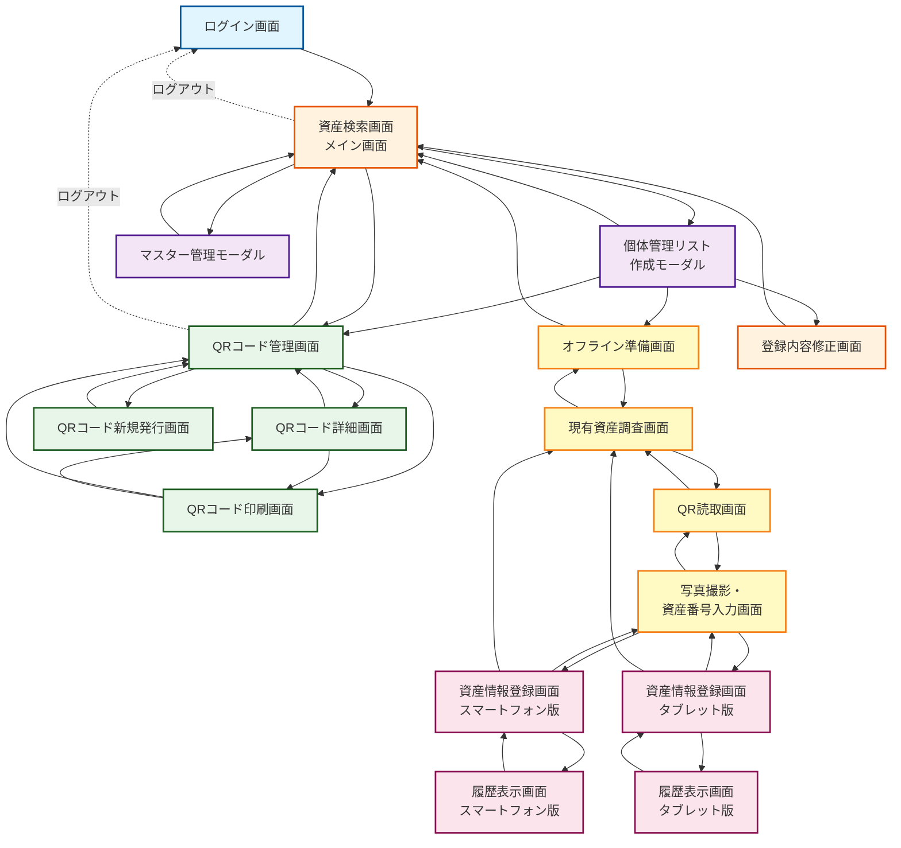
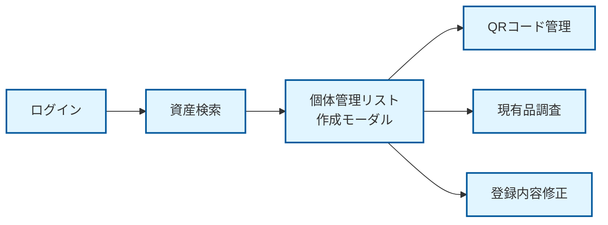
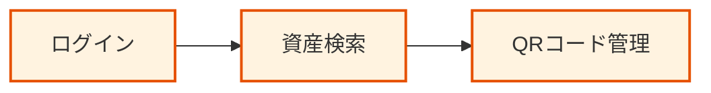
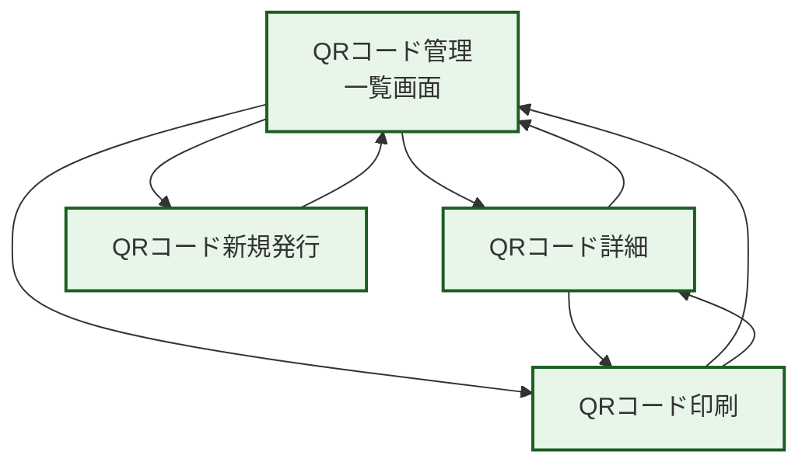
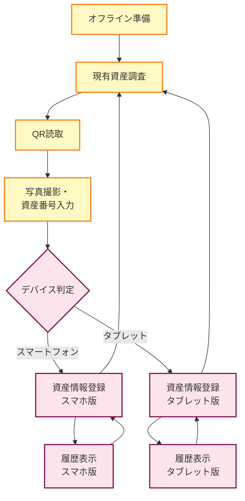

# 医療機器管理システム 画面遷移図

## 全体画面遷移図

## 画面グループ別遷移

### 1. コンサルタント向けフロー

### 2. 病院担当者向けフロー

### 3. QRコード管理フロー

### 4. 現有品調査フロー（モバイル対応）

## 画面一覧

| No. | 画面ID | 画面名 | ユーザー種別 | デバイス |
|-----|--------|--------|--------------|----------|
| 1 | loginPage | ログイン画面 | 共通 | 全デバイス |
| 2 | mainContainer | 資産検索画面 | 共通 | PC/タブレット |
| 3 | listModal | 個体管理リスト作成モーダル | コンサルタント | PC/タブレット |
| 4 | masterModal | マスター管理モーダル | コンサルタント | PC/タブレット |
| 5 | qrPage | QRコード管理画面 | 共通 | PC/タブレット |
| 6 | qrDetailPage | QRコード詳細画面 | 共通 | PC/タブレット |
| 7 | qrIssuePage | QRコード新規発行画面 | 共通 | PC/タブレット |
| 8 | qrPrintPage | QRコード印刷画面 | 共通 | PC/タブレット |
| 9 | offlinePrepPage | オフライン準備画面 | コンサルタント | PC/タブレット |
| 10 | surveyPage | 現有資産調査画面 | コンサルタント | タブレット/スマホ |
| 11 | qrScanPage | QR読取画面 | コンサルタント | タブレット/スマホ |
| 12 | photoInputPage | 写真撮影・資産番号入力画面 | コンサルタント | タブレット/スマホ |
| 13 | assetInfoSmartphonePage | 資産情報登録画面（スマホ版） | コンサルタント | スマートフォン |
| 14 | assetInfoTabletPage | 資産情報登録画面（タブレット版） | コンサルタント | タブレット |
| 15 | historyListSmartphonePage | 履歴表示画面（スマホ版） | コンサルタント | スマートフォン |
| 16 | historyListTabletPage | 履歴表示画面（タブレット版） | コンサルタント | タブレット |
| 17 | registrationEditPage | 登録内容修正画面 | コンサルタント | PC/タブレット |
| 18 | mobileColumnModal | モバイルカラム選択モーダル | 共通 | スマートフォン |
| 19 | photoModal | 写真表示モーダル | 共通 | 全デバイス |

## 遷移パターン

### パターン1: 通常遷移
- 画面全体が切り替わる
- 前の画面は非表示になる
- 例: ログイン → 資産検索

### パターン2: モーダル表示
- 現在の画面の上にモーダルが表示される
- 背景の画面は見えるが操作不可
- 例: 資産検索 → 個体管理リストモーダル

### パターン3: 条件分岐遷移
- デバイスの画面サイズで遷移先が変わる
- 例: 写真撮影 → 資産情報登録（スマホ版/タブレット版）

### パターン4: 戻り遷移
- 一つ前の画面に戻る
- モーダルの場合は閉じるだけ
- 例: QRコード詳細 → QRコード管理

## 注意事項

1. **ログアウト処理**
   - 全ての画面からログイン画面に戻る
   - セッション情報はクリアされる

2. **モーダル表示時の動作**
   - 背景クリックで閉じる
   - ESCキーで閉じる
   - 閉じる際は元の画面に戻る

3. **画面遷移時のモーダル制御**
   - 登録内容修正画面から戻る場合、個体管理リストモーダルは表示しない
   - オフライン準備画面から戻る場合、個体管理リストモーダルは表示しない

4. **レスポンシブ対応**
   - PC/タブレット: 全機能利用可能
   - スマートフォン: モバイル専用画面を表示
   - 画面幅768px以下でスマホ版に切り替え
